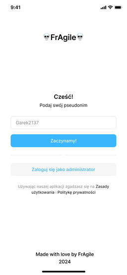
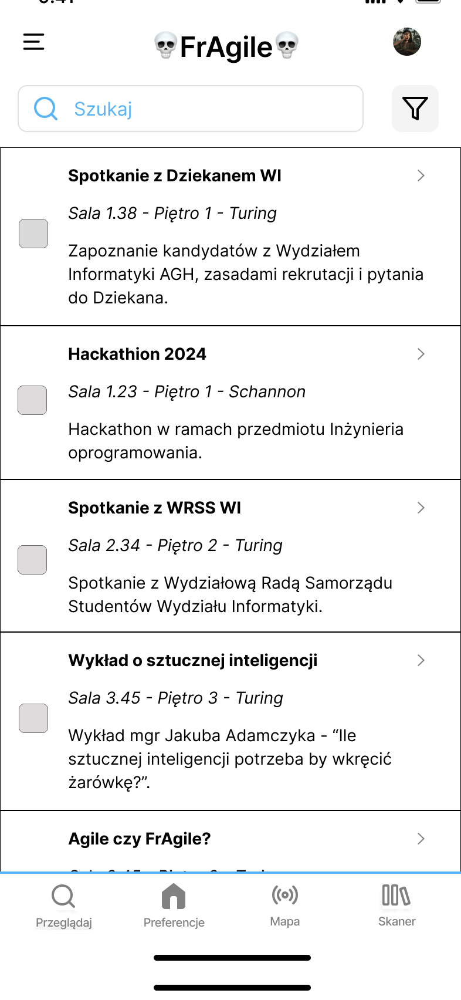
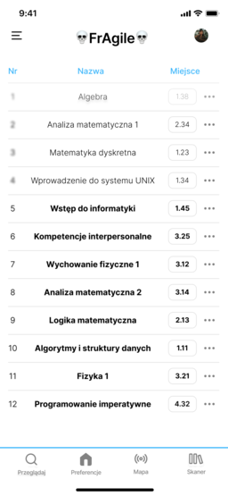
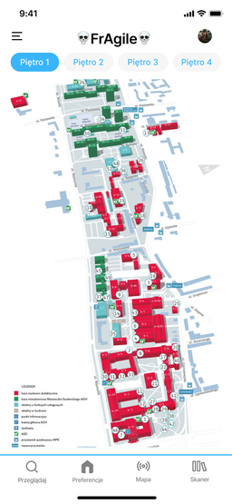
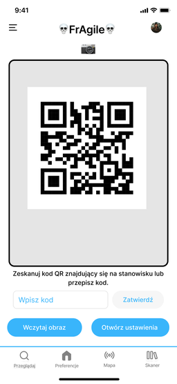
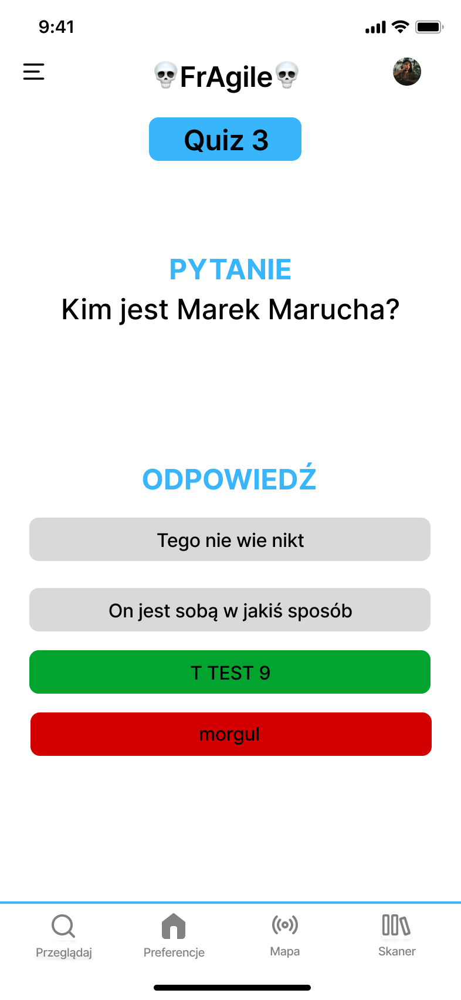

# Wizja

## Podstawowa wizja projektu:
Celem projektu jest urozmaicenie dni otwartych AGH w D17, tematem projektu jest aplikacja mobilna umożliwiająca uczestnikom imprezy na wygodne odwiedzenie interesujących ich stanowisk. Podstawowym działaniem aplikacji jest nawigowanie uczestnika pomiędzy stanowiskami oraz przedstawianie mu tematycznych quizów / minigier przy kolejnych stanowiskach.

## Zasada działania:
Użytkownik włącza aplikację i wyświetlana mu jest lista ze stanowiskami i ich opisami. Użytkownik wybiera interesujące go pozycje, ustawia je w kolejności w jakiej chciałby je odwiedzić, kiedy użytkownik jest już zdecydowany zatwierdza swoje wybory. Po zaakceptowaniu aplikacja przechodzi w stan nawigacji, zaczynając od ekranu skanowania kodu QR. Każde stanowisko posiada swój unikalny kod. Po zeskanowaniu kodu pierwszego stanowiska wyświetla się strzałka kierująca użytkownika do kolejnego stanowiska z ułożonej przez niego listy. Kiedy  Ten proces powtarza się aż do zakończenia zwiedzania.

## Dodatkowe funkcje:
Poza strzałką użytkownik widzi mapę z jego aktualną pozycją i trasą do następnego stanowiska.

Użytkownik wypełnia quiz / minigrę przy obecnym stanowisku.

## Makiety UI

### Ekran startowy
Na ekranie startowym użytkownik jest powitany i może wybrać swój pseudonim.




### Ekran z listą stanowisk do wyboru
Użytkownik wybiera interesujące go stanowiska z listy, która zawiera tytuł, króki opis oraz miejsce. Wybór interesujących aktywności odbywa się poprzez zaznaczenie checkboxa.



### Ekran z preferencjami kolejności stanowisk
Po zaznaczeniu stanowisk użytkownik przechodzi do ekranu z preferencjami kolejności odwiedzania stanowisk. Użytkownik może zmieniać kolejność przeciągając elementy listy.



### Ekran z mapą i trasą do następnego stanowiska
Po zatwierdzeniu kolejności użytkownik przechodzi do ekranu z mapą i trasą do następnego stanowiska.



### Ekran ze skanowaniem kodu QR
Użutkownik skanuje kod QR na stanowisku lub wpisuje kod.



### Ekran z quizem
Po zeskanowaniu kodu QR użytkownik przechodzi do ekranu z quizem.



# Welcome to your Expo app 👋

This is an [Expo](https://expo.dev) project created with [`create-expo-app`](https://www.npmjs.com/package/create-expo-app).

## Get started

1. Install dependencies

   ```bash
   npm install
   ```

2. Start the app

   ```bash
    npx expo start
   ```

In the output, you'll find options to open the app in a

- [development build](https://docs.expo.dev/develop/development-builds/introduction/)
- [Android emulator](https://docs.expo.dev/workflow/android-studio-emulator/)
- [iOS simulator](https://docs.expo.dev/workflow/ios-simulator/)
- [Expo Go](https://expo.dev/go), a limited sandbox for trying out app development with Expo

You can start developing by editing the files inside the **app** directory. This project uses [file-based routing](https://docs.expo.dev/router/introduction).

## Get a fresh project

When you're ready, run:

```bash
npm run reset-project
```

This command will move the starter code to the **app-example** directory and create a blank **app** directory where you can start developing.

## Learn more

To learn more about developing your project with Expo, look at the following resources:

- [Expo documentation](https://docs.expo.dev/): Learn fundamentals, or go into advanced topics with our [guides](https://docs.expo.dev/guides).
- [Learn Expo tutorial](https://docs.expo.dev/tutorial/introduction/): Follow a step-by-step tutorial where you'll create a project that runs on Android, iOS, and the web.

## Join the community

Join our community of developers creating universal apps.

- [Expo on GitHub](https://github.com/expo/expo): View our open source platform and contribute.
- [Discord community](https://chat.expo.dev): Chat with Expo users and ask questions.
